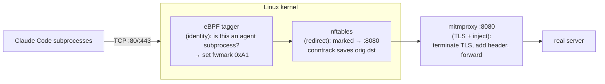
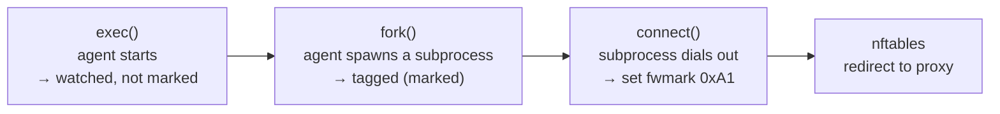

# OS-level HTTP tagging for AI coding agents with eBPF, nftables & mitmproxy

I was having an interesting discussion with a friend of mine and we were talking about AI security.
The discussion was about answering the question: can we tag all the requests a coding agent makes?
Why did we want to answer this question, you may ask.

Coding agents are (typically) run as users, however, coding agents are operating like junior developer employees and acting autonomously.
These coding agents do make mistakes and perform actions that they shouldn't, not necessarily to be malicious, but because they do not necessarily understand the policy that should be adhered to, or they misread the context.
The case to apply this would be a dedicated coding agent machine, like running OpenClaw on a dedicated VM.
This agent you may want to prevent cross environment requests e.g. qa to prod, or you have API endpoints that should not be accessed by an AI.
A low hanging fruit we thought would be to tag all HTTP requests, by tagging HTTP requests we can demonstrate that we can watch a coding agent and enforce policy upon it.
And policy enforcement must be guaranteed not a best effort.

So if you are thinking, well just run all the API requests made by a coding agent through a proxy to tag HTTP requests, this is not enforceable or guaranteed.
Setting a proxy for a Coding agent will use a proxy for the coding agent but is not guaranteed on subprocesses.
You can not use a skill bundled with scripts that use a proxy because Claude can skip the proxy and re-write the script, or re-execute it.
Then there is the other issue, if you have your coding agent write a Go script, this is compiled and ran, how do you intercept this request?

Using a prompt as a guardrail for enforcement to tag all its subprocess HTTP requests is about as reliable as Rick agreeing to a 20 minute adventure.
Useless.

Another argument, set the HTTP(S)_PROXY up.
This means that only apps or services that respect the Env variable will adhere to HTTP(S)_PROXY.
Again we want this to be a guaranteed enforcement we can not depend on the language we are running to use this.
It needs to be done on the connection.

I believe that this idea can be taken to many places, however, I wanted to start by looking at tagging HTTP requests as it seemed like it could yield tangible value for others quickly.
As a sweeping statement, by tagging the HTTP requests of all coding agents, you could apply logic to applications that if an HTTP request contains a certain header e.g. `X-AI-AGENT: TRUE`, you could then deny the request.
This could be useful if a system allows read operations to be consumed by coding agents, but destructive ones be denied.

As mentioned, for a guarantee of tagging of the HTTP request from a coding agent, we can not apply this as a prompt, it must be done at the OS level.
Additionally to add to the complexity the majority of requests are going to be HTTPS requests, so how do we man-in-the-middle the request?

## Architecture proposal

The solution proposed is as follows




The architecture proposal is to tag the Coding Agents sub processes with eBPF and all the subprocess.
This would allow for all network calls to be identified and modified.
The modified network calls would route to a locally running proxy which would then decrypt the request add a header and forward it onto the real server.

One deliberate scope choice: we tag the tools the agent **spawns** — its actions on the world, like `curl`, `git`, or a script it writes — and leave the agent's *own* model/API traffic untouched. We never decrypt the agent's own credentials; we only mark what it does through its subprocesses.

## Video demo

> INSERT VIDEO HERE

## How does it work

If you have seen the demo and want to learn more we now dive into the technical details.

### eBPF tagging

The BPF module is loaded into the kernel.
There are two core properties of the BPF functionality being used.
Intercepting when a process is launched and when a connection is opened for the network call.

When loading the BPF we have a config file of the locations of the coding agents that we want to track ([config/agents.conf](config/agents.conf) and [config/agents.yaml](config/agents.yaml))
This is a filepath list of the agents.
When the BPF runs it checks the file path of each process that starts; if it matches an entry in our config we've found an agent to watch — and we record it as *watched, not marked* (the agent's own traffic is deliberately left alone).
These hooks fire for **every** process that execs or forks on the machine, so when a watched agent spawns a subprocess that spawn runs through our hook too: we see its parent is a watched agent and tag the **child** as marked.

Now we have the marked subprocesses, we need our connect BPF function which upon a connection opening checks whether the calling process is marked.
If it is then the connection is marked with `0xa1`

You can see in this diagram the flow of the process tagging and marking



### nftables redirect

The connection is now tagged.
The routing of the connection happens according to our [setup/redirect.nft](setup/redirect.nft).

```nft
chain output_nat {
    type nat hook output priority -100; policy accept;

    # Agent TCP to 80/443 → local transparent proxy on :8080.
    meta mark 0xa1 tcp dport { 80, 443 } redirect to :8080
}
```

The rule looks for a mark 0xa1, which was set in the bpf connect function.
The mark connection will reroute a connection for port 80 and 443 to 127.0.0.1:8080 (the 127.0.0.1 is inferred even if not defined in the rule).


### Proxy configuration

The proxy setup is very straight forward.
The [mitm/inject_addon.py](mitm/inject_addon.py) script is added to the proxy and will add the `X-AI-AGENT: TRUE` header to the request.
We have no smart logic, we just say if the request goes is via our proxy then include the header.

One thing worth calling out, because it's what makes TLS interception possible at all: mitmproxy can only read a request if the client trusts its certificate. It mints a certificate per host on the fly, signed by its own CA — and [setup/ca-install.sh](setup/ca-install.sh) installs that CA into the machine's **system trust store** before any traffic flows. With that trust in place, redirected clients accept the certs and we can read and stamp the request. Without it, the redirected connection simply dies in the TLS handshake — a useful **fail-closed** property: no trust, no traffic, rather than a silent bypass.

## Critique of this solution

This is not a complete solution, it is a thought out and validated experiment.
This is only solving for HTTP request it does not work for QUIC and does not have any failure mode.
Additionally if the coding agent we want to follow is not pre-defined in the policy `agents.conf` then we would not detect the process had sent a request and tag it.

I do believe that the issues are resolvable and could be surmounted and that this is a potential way to enforce policy against coding agents at the OS level with minimum configuration for the user.

## Feedback

Now I would love to hear from you the reader, have you implemented something similar and if so what were your results.
Do you think this approach is plain wrong and do you think that prompt guardrails are good enough?

Please let me know in the comments your opinions are greatly valued.


> This post is from my own research and my own thoughts, this is in no way affiliated with the company I work for.

