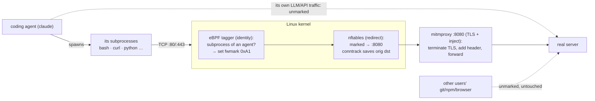

# agentmark

[](https://github.com/Budlee/agentmark/actions/workflows/ci.yml)
[](LICENSE)

**Mark every outbound HTTP(S) request made by the *subprocesses* a coding agent
spawns — its tool calls: `bash`, `curl`, `python`, `git`, … — with an
`X-AI-Agent: TRUE` header, on a multi-user Linux VM, without touching the agent. The
agent's **own** traffic (e.g. its LLM-API calls) is deliberately left untouched.**

Two guarantees:

1. **The agent is untouched** — no code, no config, no flags.
2. **The launch command is still just `claude`** — a user logs in, types `claude`,
   and notices nothing. All the machinery lives on the VM, set up once.

…and **scoped**: a user's own `git`/`npm`/browser traffic is left alone — and so is
the agent process itself. Only the **subprocesses** a configured agent spawns are marked.

## The one hard constraint (read this first)

HTTP headers live at L7, **inside TLS**, and TLS encrypts in userspace *before* any
byte reaches the kernel. A kernel packet/socket layer only ever sees **ciphertext** —
you cannot read or modify HTTPS headers there. To *inject*, you must terminate TLS as
a man-in-the-middle (which needs a trusted CA). That single fact drives the whole
design.

## How it works — each tool does what it's best at



- **eBPF** decides *identity* — which processes are **subprocesses of a configured
  agent** (the agent itself is tracked, but left unmarked) — and stamps a firewall mark
  on their sockets. The mark is the only thing it does; it's otherwise inert.
- **nftables** does the *redirect*: marked traffic → the local proxy, and `conntrack`
  remembers the original destination. **Without this the mark does nothing.**
- **mitmproxy** terminates TLS with a VM-trusted CA, the addon adds the header, and it
  forwards to the real server. Its own upstream connection isn't marked → not
  redirected → no loop, for free.

## Layout

```
agentmark/
├── tagger/
│   ├── bpf/       # the eBPF program (tagger.bpf.c, tagger.h) — SHARED
│   ├── c/         # loader option A: C + libbpf
│   └── go/        # loader option B: Go + cilium/ebpf   ← pick either
├── mitm/          # inject_addon.py (the header)
├── config/        # agents.conf (C) + agents.yaml (Go) — the allow-list
└── setup/         # setup.sh, teardown.sh, ca-install.sh, redirect.nft, sysctls
```

The eBPF program lives once in `tagger/bpf/`; the **C and Go loaders are equal,
interchangeable** ways to load it. `setup.sh` uses the C loader by default.

## Requirements

- Linux with **root**, kernel **≥ 5.8 with BTF** (`/sys/kernel/btf/vmlinux` exists)
  and **cgroup v2** (`stat -fc %T /sys/fs/cgroup` → `cgroup2fs`). Ubuntu 24.04 works.
- `clang llvm libbpf-dev libelf-dev zlib1g-dev make`, `bpftool` (from
  `linux-tools-generic`), `nftables`, `mitmproxy`, `curl`, `python3`. `setup.sh`
  installs these on Debian/Ubuntu.

## Quick start

```sh
git clone <this repo> && cd agentmark
sudo setup/setup.sh          # build tagger, trust CA, load nft+sysctls; prints next steps
```

Then run the two foreground processes it prints (no services are installed):

```sh
# terminal 1 — the proxy (leave running):
sudo mitmdump --mode transparent --showhost \
  --set confdir=/etc/agentmark/mitmproxy -s /etc/agentmark/inject_addon.py --listen-port 8080

# terminal 2 — the tagger:
sudo /usr/local/sbin/agentmark-tagger /etc/agentmark/agents.conf /sys/fs/cgroup
```

Add your agent to `/etc/agentmark/agents.conf` (`command -v claude`), then just run it.

## Step by step (what `setup.sh` does)

Each stage is independently runnable — useful for understanding it (and this is the
spine of the accompanying blog post).

```sh
# 1. Build + install the eBPF tagger (C loader; see "Choose your loader" for Go).
make -C tagger/c
sudo install -D -m0755 tagger/c/tagger /usr/local/sbin/agentmark-tagger

# 2. Install the allow-lists + the mitmproxy addon.
sudo install -D -m0644 config/agents.conf   /etc/agentmark/agents.conf
sudo install -D -m0644 config/agents.yaml   /etc/agentmark/agents.yaml
sudo install -D -m0644 mitm/inject_addon.py /etc/agentmark/inject_addon.py

# 3. Trust the MITM CA VM-wide. curl/Go/Python are covered automatically (system
#    store + certifi); only Node needs a pointer (NODE_EXTRA_CA_CERTS in
#    /etc/environment). This is the unavoidable cost of terminating TLS.
sudo bash setup/ca-install.sh

# 4. Enable the redirect — sysctls. REDIRECT sends packets to 127.0.0.1, which the
#    kernel drops as "martians" unless route_localnet=1.
sudo install -m0644 setup/90-redirect.conf /etc/sysctl.d/90-agentmark.conf
sudo sysctl --system

# 5. Load the redirect rule — nftables. Only marked (0xA1) 80/443 is redirected.
sudo install -m0644 setup/redirect.nft /etc/agentmark/redirect.nft
sudo nft -f /etc/agentmark/redirect.nft

# 6. Run it (two terminals) — see Quick start above.
```

Steps 4 and 5 are the **redirect mechanism** — not optional. The eBPF mark is inert
until nftables acts on it.

## Choose your loader: C or Go

Both load the identical `tagger/bpf/tagger.bpf.c` and behave identically.

| | C (`tagger/c`) | Go (`tagger/go`) |
|---|---|---|
| toolkit | libbpf + skeleton | cilium/ebpf + bpf2go |
| runtime deps | libbpf | none (static, CGo-free) |
| config | `agents.conf` (plain text) | `agents.yaml` |
| build | `make` | `go generate ./… && go build` |

To use Go instead: build `tagger/go` and install `tagger-go` as
`/usr/local/sbin/agentmark-tagger` (point it at `agents.yaml`). See
[`tagger/go/README.md`](tagger/go/README.md).

## Verify

```sh
# A fake agent (a #!/bin/bash script, like `claude` is a node script) that SPAWNS a
# subprocess. Note: `curl` WITHOUT `exec` — so curl runs as a *child* of the agent,
# which is what gets tagged. `exec curl` would replace the agent process itself,
# which is left untouched (so it would NOT be tagged).
printf '#!/bin/bash\ncurl -s https://postman-echo.com/get\n' | sudo tee /usr/local/bin/fake-agent
sudo chmod +x /usr/local/bin/fake-agent
echo /usr/local/bin/fake-agent | sudo tee -a /etc/agentmark/agents.conf   # then restart the tagger

# SUBPROCESS of the agent → header reaches the real server (postman-echo echoes it):
/usr/local/bin/fake-agent | grep -i x-ai-agent          # → "x-ai-agent": "TRUE"

# SCOPE PROOF — the same request, not under any agent, is untouched:
curl -s https://postman-echo.com/get | grep -i x-ai-agent || echo "no header (correct)"

# The agent's OWN traffic is untouched too — only what it spawns is tagged.
# Live tag set: the agent root has value 0 (tracked, not marked); tagged
# subprocesses have value 1 (marked).
sudo bpftool map dump name tagged_pids
```

## Security & limitations (don't skip)

- **You are decrypting the agent's *subprocess* traffic** — and any tokens those tool
  calls carry. The agent's **own** LLM-API traffic (and its API key) is *not*
  decrypted, since the agent process itself is left unmarked. The MITM **CA private
  key is a skeleton key**; keep it `600`, on the VM only, never commit it.
- **Certificate-pinned endpoints** reject the MITM CA — those calls fail rather than
  get injected (Claude's own API traffic is fine; it supports custom CAs).
- **QUIC/HTTP-3** is blocked (UDP/443 reject) to force TCP+TLS the proxy can see.
- **Fail-closed**: if mitmproxy is down, marked egress breaks — keep it running.
- **Nested namespaces**: an agent that spawns its *own* container escapes the host
  rules (separate net namespace).
- **No services shipped**: the tagger + proxy run in the foreground. For
  reboot-persistence, add your own systemd unit (or supervisor).
- **Linux only.**

## Teardown

```sh
sudo setup/teardown.sh
# stops the processes, deletes the nft table, removes the CA + /etc/environment block
```
